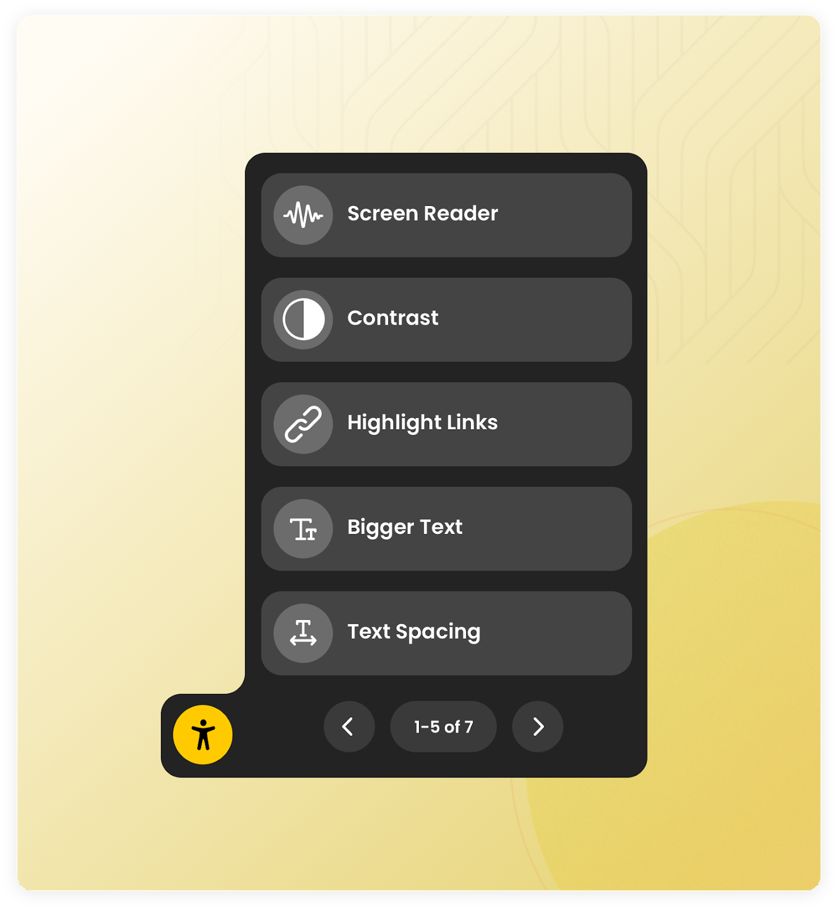

# Astral Accessibility: Open Source Accessibility Widget



# Astral is in alpha

Astral is currently in an alpha phase. You can use it today with much of its feature set implemented, but it's a few features shy, along with some general polishing away from a 1.x release.

# Overview

Astral Accessibility is an open source accessibility widget that can be easily embedded to any website. It provides a set of
accessibility features that can be used by people with accessibility needs to improve their experience on the web. Read why we
started this project [here](blue.verto.health/advancing-accessibility-with-astral/).

[Click here](https://astral-accessibility.pages.dev/) for a demo!

## Features

- Screen Reader (text to speech)
- Contrast
- Saturation
- Text Size
- Text Spacing
- Screen Mask
- More to come!

## Usage

Astral is built with Angular Elements. You can use it in your website in under 30 seconds. To add it, simply include the Javascript and initialize it:

```html
<script src="https://astral-accessibility.pages.dev/main.js"></script>
<script>
  initializeAstral();
</script>
```

Optionally we can choose which widgets should appear by passing an object inside of function call:

```html
<script>
  initializeAstral({
    filterWidget: ["Contrast", "Bigger Text", "Screen Mask"],
  });
</script>
```

## Development Setup

1. Clone the repository

```
git clone git@github.com:verto-health/astral-accessibility.git
```

2. Install dependencies

```
$ yarn install
```

3. Run the development server and visit `http://localhost:8000`

```bash
$ yarn run start:demo
```

This will watch for changes and automatically reload when you make changes in both Angular and the demo app under `projects/demo`.

### Running E2E Tests With Cypress

After running the steps above, you will have access to the Cypress test suite. To run Cypress locally, run the following command in your terminal

```
$ yarn cypress open
```

Choose E2E Testing, and select a browser to start running the Specs
