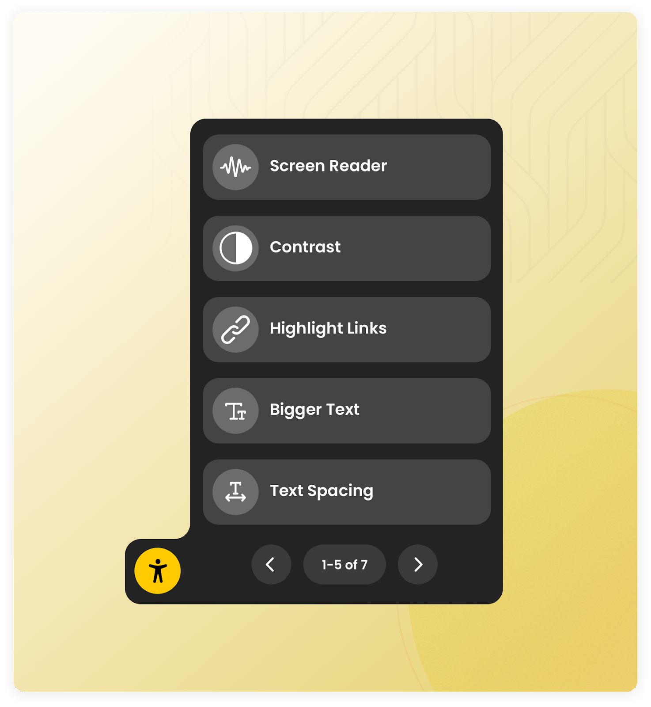

# Astral Accessibility: Open Source Accessibility Widget



# Astral is in alpha

Astral is currently in an alpha phase. You can use it today with much of its feature set implemented, but it's a few features shy, along with some general polishing away from a 1.x release.

# Overview

Astral Accessibility is an open source accessibility widget that can be easily embedded to any website. It provides a set of
accessibility features that can be used by people with accessibility needs to improve their experience on the web. Read why we
started this project [here](https://blue.verto.health/advancing-accessibility-with-astral/).

[Click here](https://astral-accessibility.pages.dev/) for a demo!

## Features

- Screen Reader (text to speech)
- Contrast
- Saturation
- Text Size
- Text Spacing
- Screen Mask
- Line Height
- More to come!

| Key             | Capability                                                                                                                                                                                                                                                                                                 |
| --------------- | ---------------------------------------------------------------------------------------------------------------------------------------------------------------------------------------------------------------------------------------------------------------------------------------------------------- |
| `Screen Reader` | Screen reader is a tool where it would reads out texts on screen where user clicks on. For any html elements, if an aria label is available, the content from aria label would be read out loud, otherwise, it reads the text content of the element. There are 3 different speeds, normal, fast and slow. |
| `Contrast`      | Contrast is a tool that removes background and replaces it with black or white to increase the difference in colours between text and the background to increase legibility. There are 3 modes, the invert colours, high contrast, and dark high contrast.                                                 |
| `Saturation`    | Saturation is a tool that adjusts how colourful the colours are on screen, it has 3 different modes to lower saturation, increase saturation, or remove all the colours on screen (black and white).                                                                                                       |
| `Bigger Text`   | Bigger Text is a tool that increases the size of the texts on screen.                                                                                                                                                                                                                                      |
| `Text Spacing`  | Text Spacing is a tool that increases the spacing between each character on the screen to increase legibility and readibility.                                                                                                                                                                             |
| `Screen Mask`   | Screen Mask is a tool which dims the background and has a smaller focused area which follows the cursor sliding up and down the page.                                                                                                                                                                      |
| `Line Spacing`  | Line Spacing is a tool which increases the space between lines for greater readability.                                                                                                                                                                                                                    |

## Usage

Astral is built with Angular Elements. You can use it in your website in under 30 seconds. To add it, simply include the Javascript and initialize it:

Note: By default this function all will add all available features, for enabling only certain features, see the section below on Customizing Widget.

```html
<script src="https://astral-cdn.vertolink.com/latest/main.js"></script>
<script>
  initializeAstral();
</script>
```

### CDN channels

Astral is served from `https://astral-cdn.vertolink.com/{channel}/main.js`. Three channels are available:

| Channel  | URL                                               | Use when                                                                                 |
| -------- | ------------------------------------------------- | ---------------------------------------------------------------------------------------- |
| `latest` | `https://astral-cdn.vertolink.com/latest/main.js` | You want the most recent stable build from `main`. Updates automatically.                |
| `v1.2.3` | `https://astral-cdn.vertolink.com/v1.2.3/main.js` | You want a specific release pinned forever. Replace `v1.2.3` with any published version. |
| `dev`    | `https://astral-cdn.vertolink.com/dev/main.js`    | Preview builds from the `dev` branch. May be unstable.                                   |

To see all available version tags:

```
https://astral-cdn.vertolink.com/versions
```

## Customizing Widget

Astral-Accessibility allows you to customize the widget to your needs. This mean you can enable the features you want and hide the features you may not need.
You can choose which widgets should appear by passing an object inside of the `inititalizeAstral` function call. Inside the object include a key called `enabledFeatures` with the value of a list containing strings of which features you want enabled.

Here's an example:

```html
<script>
  initializeAstral({
    filterWidget: ["Contrast", "Bigger Text", "Screen Mask"],
  });
</script>
```

Optionally we can choose which widgets should appear by passing an object inside of function call:

```html
<script>
  initializeAstral({
    enabledFeatures: [
      "Screen Reader",
      "Contrast",
      "Saturation",
      "Bigger Text",
      "Text Spacing",
      "Screen Mask",
      "Line Height",
    ],
  });
</script>
```

### Configuring Widget Position

By default the widget appears in the bottom-right corner of the screen. You can change this by passing a `position` option to `initializeAstral`.

Supported values:

| Value          | Description                       |
| -------------- | --------------------------------- |
| `bottom-right` | Bottom-right corner **(default)** |
| `bottom-left`  | Bottom-left corner                |
| `top-right`    | Top-right corner                  |
| `top-left`     | Top-left corner                   |

```html
<script>
  initializeAstral({
    position: "bottom-left",
    enabledFeatures: [
      "Screen Reader",
      "Contrast",
      "Saturation",
      "Bigger Text",
      "Text Spacing",
      "Screen Mask",
      "Line Height",
    ],
  });
</script>
```

### Customizing Toggle Button Color

You can customize the background color of the toggle button to match your website's branding by passing `toggleColor` to `initializeAstral`. Any valid CSS color value is accepted (hex, RGB, named colors, etc.).

```html
<script>
  initializeAstral({
    toggleColor: "#0057b8",
  });
</script>
```

If your brand color is dark, set `toggleIconColor` to `#ffffff` so the icon remains visible:

```html
<script>
  initializeAstral({
    toggleColor: "#0057b8",
    toggleIconColor: "#ffffff",
  });
</script>
```

> **Accessibility note:** Ensure your chosen `toggleColor` provides sufficient contrast with `toggleIconColor` (default `#000000`). WCAG AA requires a contrast ratio of at least 3:1 for graphical elements.

## Language Support

Astral supports multiple languages for the widget UI labels and text-to-speech voice selection. The built-in languages are:

| Code      | Language            |
| --------- | ------------------- |
| `en`      | English (default)   |
| `fr`      | French              |
| `zh-Hant` | Traditional Chinese |

### Setting the language at initialisation

Pass a `language` key to `initializeAstral`:

```html
<script>
  initializeAstral({
    enabledFeatures: ["Screen Reader", "Contrast"],
    language: "fr",
  });
</script>
```

### Switching language at runtime

After initialisation, call `window.astralSetLanguage` with a language code. This updates both the widget labels and the screen reader's text-to-speech voice:

```js
window.astralSetLanguage("zh-Hant");
```

A typical pattern when your page has its own language switcher:

```html
<select id="lang-select">
  <option value="en">English</option>
  <option value="fr">Français</option>
  <option value="zh-Hant">繁體中文</option>
</select>

<script>
  document.getElementById("lang-select").addEventListener("change", (e) => {
    window.astralSetLanguage(e.target.value);
  });
</script>
```

## Development Setup

1. Clone the repository

```
git clone git@github.com:verto-health/astral-accessibility.git
```

2. Install dependencies

```
$ yarn install
```

3. Run the development server and visit `http://localhost:8000`

```bash
$ yarn run start:demo
```

This will watch for changes and automatically reload when you make changes in both Angular and the demo app under `projects/demo`.

### Running E2E Tests With Cypress

After running the steps above, you will have access to the Cypress test suite. To run Cypress locally, run the following command in your terminal

```
$ yarn cypress open
```

Choose E2E Testing, and select a browser to start running the Specs

## Contributors ✨

<!-- ALL-CONTRIBUTORS-LIST:START - Do not remove or modify this section -->
<!-- prettier-ignore-start -->
<!-- markdownlint-disable -->

<!-- markdownlint-restore -->
<!-- prettier-ignore-end -->

<!-- ALL-CONTRIBUTORS-LIST:END -->
